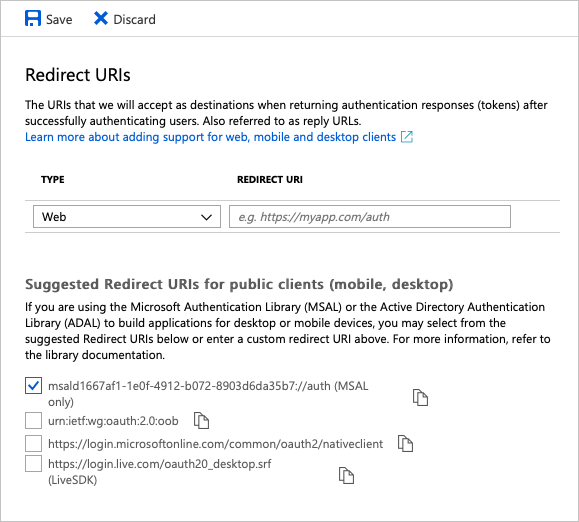

# Cómo ejecutar el proyecto completadoHow to run the completed project

## Requisitos previosPrerequisites

Para ejecutar el proyecto completado en esta carpeta, necesita lo siguiente:To run the completed project in this folder, you need the following:

- [Android Studio](https://developer.android.com/studio/) instalado en el equipo de desarrollo.[Android Studio](https://developer.android.com/studio/) installed on your development machine. (**Nota:** este tutorial se ha redactado con Android Studio versión 3.3.1 con 1.8.0 JRE y el SDK de Android 9,0.(**Note:** This tutorial was written with Android Studio version 3.3.1 with the 1.8.0 JRE and the Android 9.0 SDK. Los pasos de esta guía pueden funcionar con otras versiones, pero no se han probado.The steps in this guide may work with other versions, but that has not been tested.)
- Una cuenta de Microsoft personal con un buzón de correo en Outlook.com o una cuenta profesional o educativa de Microsoft.Either a personal Microsoft account with a mailbox on Outlook.com, or a Microsoft work or school account.

Si no tiene una cuenta de Microsoft, hay un par de opciones para obtener una cuenta gratuita:If you don't have a Microsoft account, there are a couple of options to get a free account:

- Puede [registrarse para obtener una nueva cuenta Microsoft personal](https://signup.live.com/signup?wa=wsignin1.0&rpsnv=12&ct=1454618383&rver=6.4.6456.0&wp=MBI_SSL_SHARED&wreply=https://mail.live.com/default.aspx&id=64855&cbcxt=mai&bk=1454618383&uiflavor=web&uaid=b213a65b4fdc484382b6622b3ecaa547&mkt=E-US&lc=1033&lic=1).You can [sign up for a new personal Microsoft account](https://signup.live.com/signup?wa=wsignin1.0&rpsnv=12&ct=1454618383&rver=6.4.6456.0&wp=MBI_SSL_SHARED&wreply=https://mail.live.com/default.aspx&id=64855&cbcxt=mai&bk=1454618383&uiflavor=web&uaid=b213a65b4fdc484382b6622b3ecaa547&mkt=E-US&lc=1033&lic=1).
- Puede [registrarse para el programa de desarrolladores de office 365](https://developer.microsoft.com/office/dev-program) para obtener una suscripción gratuita a Office 365.You can [sign up for the Office 365 Developer Program](https://developer.microsoft.com/office/dev-program) to get a free Office 365 subscription.

## Registrar una aplicación con Azure portalRegister an application with the Azure Portal

1. Abra un explorador y vaya al [centro de administración de Azure Active Directory](https://aad.portal.azure.com) e inicie sesión con una **cuenta personal** (también conocida como: cuenta Microsoft) o una **cuenta profesional o educativa**.Open a browser and navigate to the [Azure Active Directory admin center](https://aad.portal.azure.com) and login using a **personal account** (aka: Microsoft Account) or **Work or School Account**.

1. Seleccione **Azure Active Directory** en el panel de navegación izquierdo y seleccione **Registros de aplicaciones (versión preliminar)** en **Administrar**.Select **Azure Active Directory** in the left-hand navigation, then select **App registrations (Preview)** under **Manage**.

    

1. Seleccione **Nuevo registro**.Select **New registration**. En la página **Registrar una aplicación**, establezca los valores siguientes.On the **Register an application** page, set the values as follows.

    - Establezca **Nombre** como `Android Graph Tutorial`.Set **Name** to `Android Graph Tutorial`.
    - Establezca **Tipos de cuenta admitidos** en **Cuentas en cualquier directorio de organización y cuentas personales de Microsoft**.Set **Supported account types** to **Accounts in any organizational directory and personal Microsoft accounts**.
    - Deje **URI de redireccionamiento** vacía.Leave **Redirect URI** empty.

    

1. Elija **Registrar**.Choose **Register**. En la página **tutorial de Xamarin Graph** , copie el valor del **identificador de la aplicación (cliente)** y guárdelo, lo necesitará en el paso siguiente.On the **Xamarin Graph Tutorial** page, copy the value of the **Application (client) ID** and save it, you will need it in the next step.

    

1. Seleccione el vínculo **Agregar un URI de** redireccionamiento.Select the **Add a Redirect URI** link. En la página **URI** de redireccionamiento, busque la sección **URI de redireccionamiento sugeridos para clientes públicos (móvil, escritorio)** .On the **Redirect URIs** page, locate the **Suggested Redirect URIs for public clients (mobile, desktop)** section. Seleccione el URI que comience con `msal` y cópielo y, después, elija **Guardar**.Select the URI that begins with `msal` and copy it, then choose **Save**. Guarde el URI de redireccionamiento copiado y lo necesitará en el paso siguiente.Save the copied redirect URI, you will need it in the next step.

    

## Ejecutar el ejemploRun the sample

En Android Studio, elija **Ejecutar "aplicación"** en el menú **Ejecutar** .In Android Studio, choose **Run 'app'** on the **Run** menu.